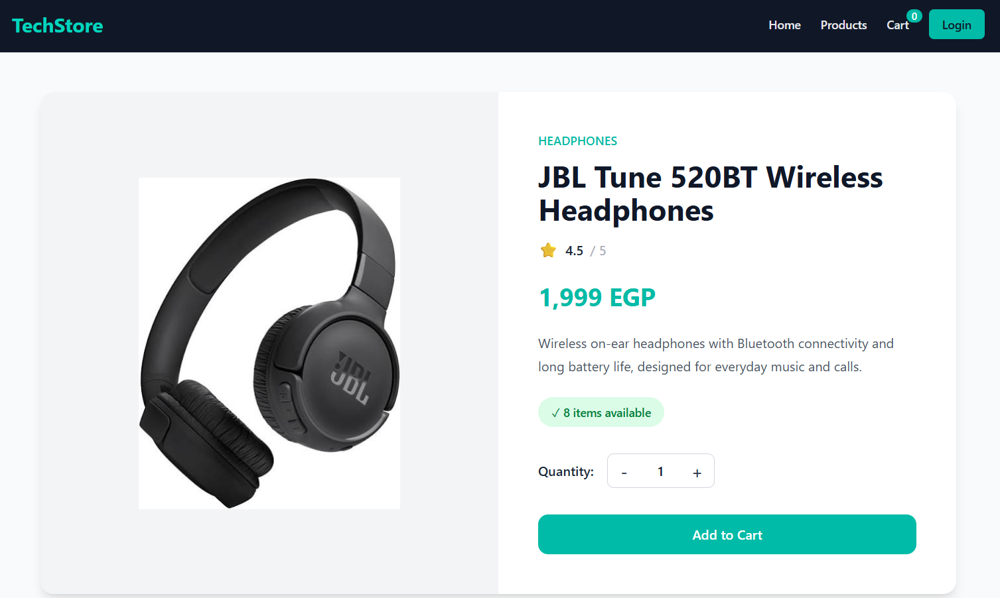
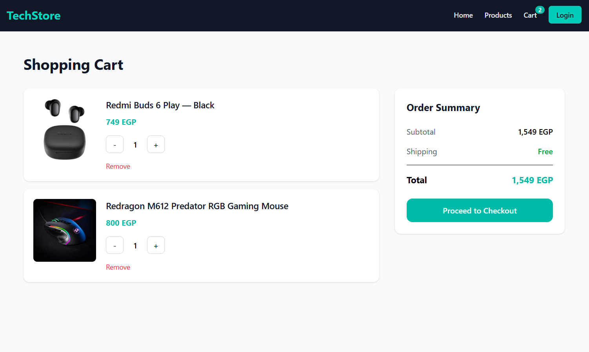
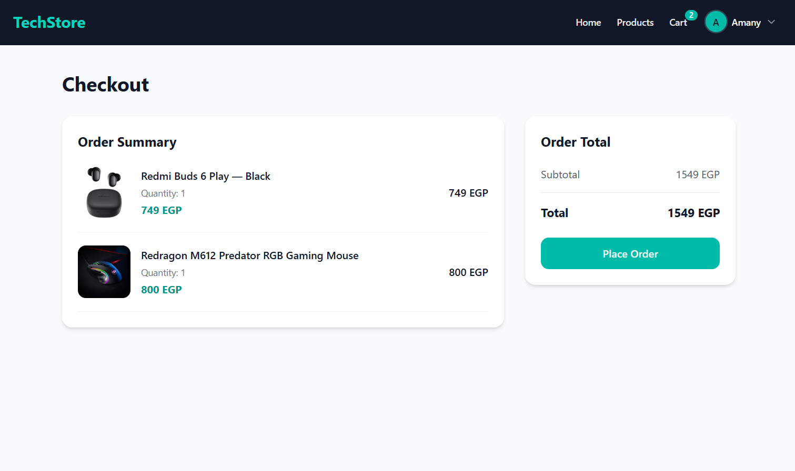

# 🛒 TechStore

A full-stack e-commerce web application for browsing and buying electronics — phones, laptops, tablets, headphones, accessories, gaming gear, and smart watches. Built with the **MERN stack** (MongoDB, Express, React, Node.js), featuring a customer-facing storefront and a full admin dashboard for managing products and orders.

**🔗 Live Demo:** [https://techstore-frontend.vercel.app/](https://techstore-frontend.vercel.app/)

> ⚠️ **Note:** This project is deployed on free-tier hosting (Vercel + Railway). The live link may go down, spin down after inactivity, or stop working after the free trial period ends. If the link above isn't working, feel free to clone the repo and run it locally using the setup instructions below.

---

## 📸 Screenshots

<!-- Replace the src paths below with your own image files, e.g. ./screenshots/home.png -->

**Home Page**


**Products Page**


**Product Details**


**Cart**


**Checkout**



## ✨ Features

### Customer-facing
- Browse all products with category filtering
- Featured products section on the Home page
- Product detail pages with quantity selector
- Shopping cart with persistent state (localStorage)
- Stock-aware cart (can't exceed available stock)
- Checkout flow with order placement
- Order history for logged-in users
- User registration & login (JWT-based auth)
- Fully responsive design (mobile, tablet, desktop)

### Admin panel
- Protected admin-only routes
- Dashboard with key stats: total products, orders, users, revenue, and low-stock alerts
- Product management: create, edit, delete, search, filter by category, pagination
- Image upload (file upload or paste an image URL)
- "Featured products" toggle (limited slots for the Home page)
- Order management: view all orders and update order status (pending → shipped → delivered)

### Backend / API
- RESTful API built with Express
- JWT authentication & role-based authorization (admin vs. regular user)
- Password hashing with bcrypt
- Image uploads via Multer, with optional Cloudinary integration (falls back to local disk storage in development)
- Stock validation and automatic rollback if an order fails partway through
- MongoDB data modeling with Mongoose

---

## 🛠️ Tech Stack

**Frontend**
- React 19 + Vite
- React Router v7
- Tailwind CSS v4
- Axios
- Context API (Auth & Cart state)

**Backend**
- Node.js + Express 5
- MongoDB + Mongoose
- JSON Web Tokens (JWT) for auth
- bcryptjs for password hashing
- Multer (+ optional Cloudinary) for image uploads
- CORS, dotenv

**Deployment**
- Frontend: [Vercel](https://vercel.com)
- Backend: [Railway](https://railway.app)
- Database: MongoDB Atlas

---

## 📁 Project Structure

```
TechStore/
├── backend/
│   ├── controllers/       # Route handler logic (auth, products, orders, admin)
│   ├── middleware/        # Auth (JWT) & file upload middleware
│   ├── models/            # Mongoose schemas (User, Product, Order)
│   ├── routes/            # Express route definitions
│   ├── data/               # Seed data
│   ├── seed.js            # Script to seed the database with sample products
│   └── server.js          # App entry point
│
└── frontend/
    ├── src/
    │   ├── components/    # Reusable UI components (Navbar, Footer, ProductCard, etc.)
    │   │   └── admin/     # Admin-only layout components
    │   ├── context/       # Auth & Cart context providers
    │   ├── pages/         # Route-level pages
    │   │   └── admin/     # Admin dashboard pages
    │   ├── utils/         # Axios instance & shared constants
    │   ├── App.jsx        # Route definitions
    │   └── main.jsx       # App entry point
    └── vercel.json         # SPA rewrite rules for Vercel
```

---

## ⚙️ Getting Started (Local Setup)

### Prerequisites
- [Node.js](https://nodejs.org/) (v18+ recommended)
- A [MongoDB](https://www.mongodb.com/) database (local or MongoDB Atlas)
- *(Optional)* A [Cloudinary](https://cloudinary.com/) account for cloud image storage

### 1. Clone the repository
```bash
git clone https://github.com/your-username/techstore.git
cd techstore
```

### 2. Backend setup
```bash
cd backend
npm install
```

Create a `.env` file in the `backend/` folder:
```env
PORT=5000
MONGO_URI=your_mongodb_connection_string
JWT_SECRET=your_jwt_secret_key
CLIENT_URL=http://localhost:5173

# Optional — only needed if you want Cloudinary image hosting.
# If omitted, uploaded images are stored locally in backend/uploads/
CLOUDINARY_CLOUD_NAME=
CLOUDINARY_API_KEY=
CLOUDINARY_API_SECRET=
```

Run the backend:
```bash
npm run dev
```
The API will be running at `http://localhost:5000`.

*(Optional)* Seed the database with sample products:
```bash
node seed.js
```

### 3. Frontend setup
```bash
cd ../frontend
npm install
```

Update the API base URL in `src/utils/api.js` to point to your local backend:
```js
baseURL: "http://localhost:5000",
```

Run the frontend:
```bash
npm run dev
```
The app will be running at `http://localhost:5173`.

---

## 🔑 Environment Variables (Backend)

| Variable                 | Description                                              | Required |
|---------------------------|------------------------------------------------------------|----------|
| `PORT`                    | Port the server runs on (default: 5000)                    | No       |
| `MONGO_URI`                | MongoDB connection string                                  | Yes      |
| `JWT_SECRET`               | Secret key used to sign JWTs                                | Yes      |
| `CLIENT_URL`               | Allowed CORS origin (your frontend URL)                    | No       |
| `CLOUDINARY_CLOUD_NAME`    | Cloudinary cloud name (enables Cloudinary image storage)    | No       |
| `CLOUDINARY_API_KEY`       | Cloudinary API key                                          | No       |
| `CLOUDINARY_API_SECRET`    | Cloudinary API secret                                        | No       |

---

## 📡 Key API Endpoints

| Method | Endpoint                          | Description                          | Access        |
|--------|------------------------------------|---------------------------------------|---------------|
| POST   | `/api/auth/register`               | Register a new user                   | Public        |
| POST   | `/api/auth/login`                  | Log in and receive a JWT              | Public        |
| GET    | `/api/products`                    | Get all products                      | Public        |
| GET    | `/api/products/featured`           | Get featured products                 | Public        |
| GET    | `/api/products/:id`                | Get a single product                  | Public        |
| POST   | `/api/products`                    | Create a product (with image upload)  | Admin         |
| PUT    | `/api/products/:id`                 | Update a product                      | Admin         |
| DELETE | `/api/products/:id`                 | Delete a product                      | Admin         |
| PATCH  | `/api/products/:id/feature`         | Toggle featured status                | Admin         |
| GET    | `/api/products/admin`              | Paginated/searchable product list     | Admin         |
| POST   | `/api/orders`                      | Place a new order                     | Logged-in user|
| GET    | `/api/orders/mine`                  | Get the current user's orders         | Logged-in user|
| GET    | `/api/orders`                       | Get all orders                        | Admin         |
| PATCH  | `/api/orders/:id/status`            | Update an order's status              | Admin         |
| GET    | `/api/admin/stats`                  | Dashboard summary stats               | Admin         |

---

## 🚧 Known Limitations

- Hosted on free-tier services — the live demo link may become inactive after a period of time.
- The backend's free-tier hosting may "spin down" after inactivity, causing a slow first request while it wakes up.
- Without Cloudinary configured, uploaded images are stored on the server's local disk and will be lost on redeploy.

---

## 🙋 Author

Built by Amany Othman
- GitHub: [@Amany-Othman](https://github.com/Amany-Othman)
- Email: amanyyothman18@gmail.com

---

## 📄 License

This project is licensed under the MIT License — feel free to use it for learning or as a portfolio reference.